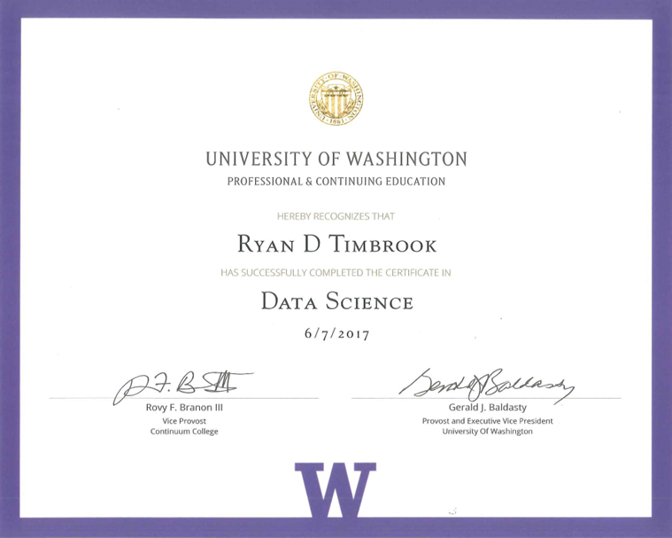

## Ryan Timbrook (Student - Course Work Repository)
**[LinkedIn Profile](https://www.linkedin.com/in/ryantimbrook/)**
### [Certificate in Data Science](https://www.pce.uw.edu/certificates/data-science)
#### [DATASCIE 250 - Intro To Data Science](https://www.pce.uw.edu/courses/data-science-process-and-tools)
#### SYLLABUS

                                  **University of Washington, Professional & Continuing Education**
                                       **DATASCIE 250 - Intro To Data Science**     

**ABOUT THIS COURSE:**  
Organizations making the transition to data-driven processes must employ the most effective methods to exploit their data assets. In this course, you’ll gain a broad overview of best practices and top software platforms used in the data science field. We’ll explore the core data science processes required to handle complex analytics problems. You’ll discover how to determine data requirements, query and integrate complex data, and build data science pipelines. Develop the skills to address business problems with data-driven recommendations that can be understood by a non-technical audience.

**Topics Include:**
* Techniques for prediction using analytics and machine learning models
* Basics of supervised and unsupervised learning, including classifier, regression and clustering models
* Methods for “wrangling” structured and unstructured data

**GET HANDS-ON EXPERIENCE:**
* Develop data science solutions for complex data sets in iterative steps
* Use the Python and R language's to load data, prepare data for analysis, compute summary statistics, create charts and execute functions

University of Washington, Certificate in Data Science - DATASCI 250 - Intro to Data Science
